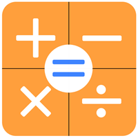

# **<br/>Simple Programmable Calculator<br/>**
## **I. Introduction**
This project is to build a simple programmable calculator, 
which has its own language, and is very easy to learn. 
## **II. Prerequisite**
- Programming language: Python 2.7 
- Package: ply (Lex and Yacc were used) 

## **III. Language**
### 1. Basic grammar 
#### 1.1 Reserved keyword 

| Keyword       | Usage                 |
|---------------|-----------------------|
| **out**       | output result         |
| **define**    | declare a variable    |
| **function**  | declare a function    |
| **return**    | return to caller      |
| **if**        | implement branch      |
| **else**      | implement branch      |
| **true**      | boolean value         |
| **false**     | boolean value         |

#### 1.2 Identifier 
##### 1.2.1 Built-in identifier 

| Name  | Value         |
|-------|---------------|
| **pi**| 3.14159265359 |
| **e** | 2.71828182846 |

##### 1.2.2 Usage 
- All identifier begins with letters (A-Z or a-z) 
- There can be letters or underscore after the first character
- Identifier is case-sensitive 
- Identifier can not be reserved keyword 
- It is okay to change the value of built-in indentifier
- Valid identifier: age, length_of_table 
- Invalid indentifier: _age, lengt1_of_table 

#### 1.3 Operators 
##### 1.3.1 Arithmetic operators 

| Operators | Name      | Example       | Precedence |
|-----------|:----------|:--------------|:----------:|
| \*        | time      | 3 \* 5 = 15   | 1          |
| /         | divide    | 20 / 10 = 2   | 1          |
| %         | mod       | 40 % 3 = 1    | 1          |
| ^         | power     | 9 ^ 2 = 81    | 1          |
| \+        | plus      | 1 + 1 = 2     | 2          |
| \-        | minus     | 13 - 6 = 7    | 2          |

##### 1.3.2 Relational operators 

| Operators | Name                      | Example       | Precedence |
|-----------|:--------------------------|:--------------|:----------:|
| \>=       | greater than or equal to  | 5 >= 3        | 1          |
| <=        | less than or equal to     | 2 <= 4        | 1          |
| ==        | equal to                  | 2 == 2        | 1          |
| !=        | not equal to              | 1 != 0        | 1          |
| \>        | greater than              | 9 > 8         | 2          |
| <         | less than                 | 6 < 7         | 2          |

##### 1.3.3 Logical operators 

| Operators | Name | Example                | Precedence |
|-----------|------|------------------------|:----------:|
| !         | not  | !(true) = false        | 1          |
| &&        | and  | true && false =  false | 2          |
| &#124;&#124;| or   | true &#124;&#124; false = true | 2|

### 2. Structures 
#### 2.1 Sequential 
##### 2.1.1 Arithmetic laws 
sample code: 

```
define a = 10.5; 
define b = 4; 
out(a + b); 
out(a - b); 
out(a * b); 
out(a / b); 
```
sample output: 

```
14.5 
6.5 
42.0 
2.625 
```

##### 2.1.2 Logical laws 
sample code: 

```
define x = true; 
define y = false; 
out(x && x); 
out(y && y); 
out(x && y); 
out(x || x); 
out(y || y); 
out(x || y); 
```
sample output: 

```
True 
False 
False 
True 
False 
True 
```

#### 2.2 Branch 
##### 2.2.1 IF 
sample code: 

```
define x = 1; 
define y = 2; 
if (x < y) { 
	out(x); 
} 
```
sample output: 

```
1.0 
```

##### 2.2.2 IF-ELSE 
sample code: 

```
define x = 1; 
define y = 2; 
if (x == y) { 
	out(x);	
} else { 
	out(y); 
} 
```
sample output: 

```
2.0 
```

#### 2.3 Loop 
sample code: 

```
define a = 2; 
while (a < 5) { 
    a = a + 1; 
    out(a); 
} 
```
sample output: 

```
3.0 
4.0 
5.0 
```

### 3. Function 
#### 3.1 Define a function 
sample code: 

```
function abs(num) { 
    if (num < 0) { 
        return (0 - num); 
    } else { 
        return num; 
    } 
} 
 
function factorial(number) { 
    if (number == 1) { 
        return 1; 
    } else { 
        return number * factorial(number - 1); 
    } 
} 
```

#### 3.2 Call a function 
##### 3.2.1 Built-in functions 
sample code: 

```
out(sin(pi/6)); 
out(cos(pi/3)); 
out(tan(pi/4)); 
out(sinh(0.5)); 
out(cosh(0.5)); 
out(tanh(1)); 
out(ln(e^3)); 
out(lg(1000)); 
out(sqrt(169)); 
```
sample output: 

```
0.5 
0.5 
1.0 
0.521095305494 
1.12762596521 
0.761594155956 
3.04858735157 
13.0 
```

##### 3.2.2 Self-defined functions 
sample code: 

```
out(abs(-5)); 
out(abs(-6.78)); 
out(factorial(5)); 
out(factorial(3)); 
```
sample output: 

```
5.0 
6.78 
120.0 
6.0 
```

## **IV. Error Handling**
### 4.1 Lexical analyzer 
sample code: 

```
@
$
```

sample output: 

```
Illegal character: @ in line 1 
Illegal character: $ in line 2 
```

### 4.2 Syntax analyzer 
sample code: 

```
functions max() {} 
out(1 ++ 1); 
out(2016) 
```

sample output: 

```
Syntax error at max in line 1 
Syntax error at + in line 2 
Syntax error at EOF 
```

### 4.3 Interpreter 
sample code: 

```
out(13 / 0); 
sqrt(-625); 
out(a + 1); 
love(9 * 9); 
```

sample output: 
```
ERROR: divisor can't be zero 
ERROR: argument must be positive number in sqrt function 
ERROR: unbound variable: a 
ERROR: call to non-function: love 
```